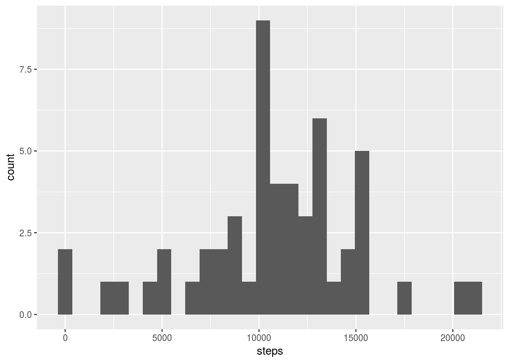
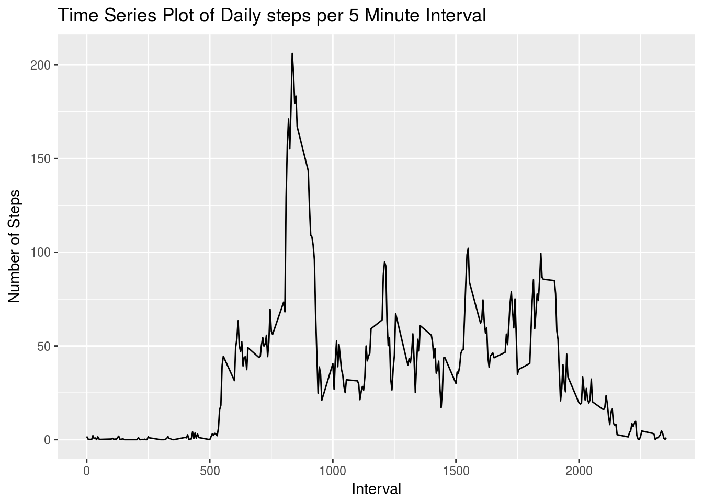
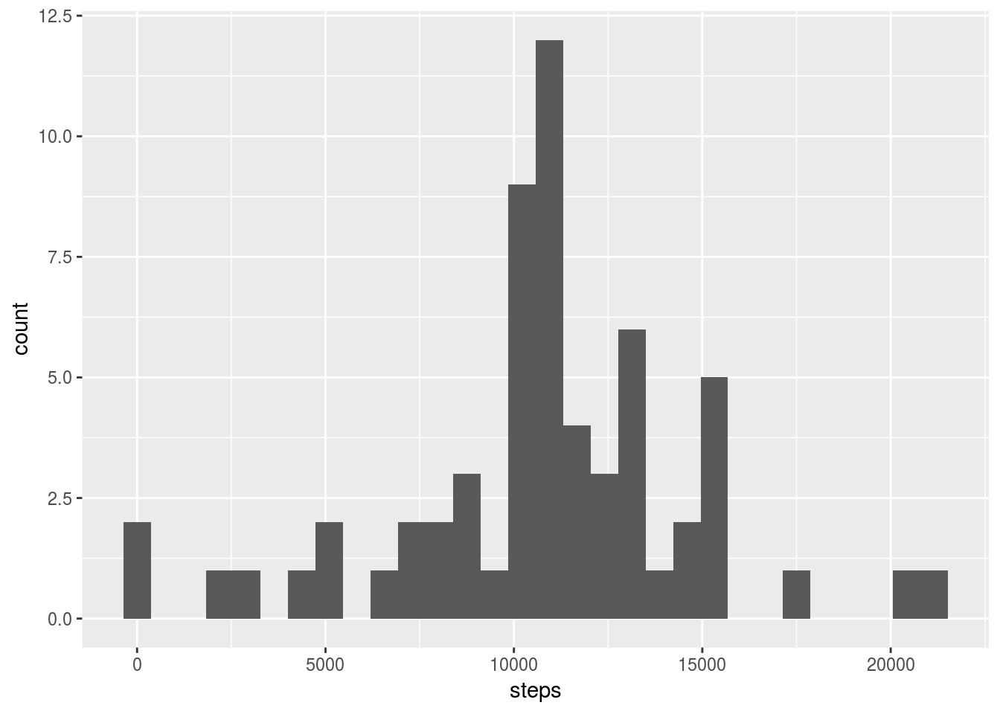
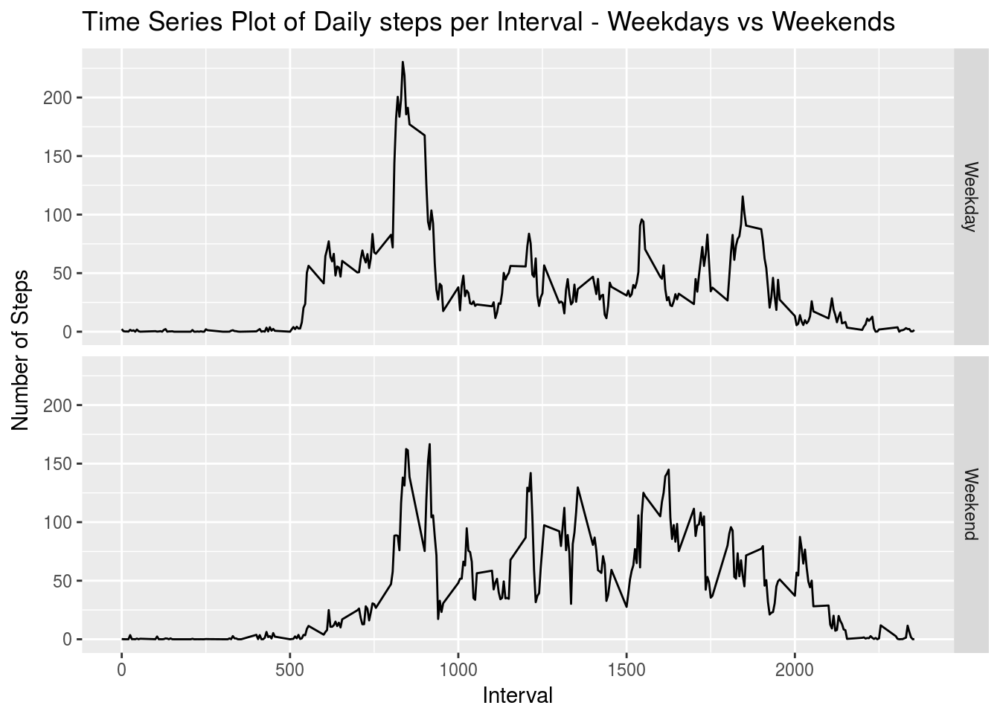

## Prep the environment with the appropriate libraries

```r
library(tidyverse)
```
## Unzip and load in the data

```r
unzip(zipfile="data/activity.zip") # Unzip the file
```

```
## Warning in unzip(zipfile = "data/activity.zip"): error 1 in extracting from
## zip file
```

```r
activity <- read_csv("data/activity.csv") # Read in the CSV
```

```
## Parsed with column specification:
## cols(
##   steps = col_integer(),
##   date = col_date(format = ""),
##   interval = col_integer()
## )
```

```r
activity_clean <- activity[complete.cases(activity),] # Remove NA values
```

#Assignment Questions

## What is mean total number of steps taken per day?
For this part of the assignment, you can ignore the missing values in the dataset.

Calculate the total number of steps taken per day  

```r
steps_day <- group_by(activity_clean, date)
steps_day <- summarize(steps_day, steps=sum(steps))

summary(steps_day)
```

```
##       date                steps      
##  Min.   :2012-10-02   Min.   :   41  
##  1st Qu.:2012-10-16   1st Qu.: 8841  
##  Median :2012-10-29   Median :10765  
##  Mean   :2012-10-30   Mean   :10766  
##  3rd Qu.:2012-11-16   3rd Qu.:13294  
##  Max.   :2012-11-29   Max.   :21194
```
  
Make a histogram of the total number of steps taken each day  

```r
qplot(steps, data=steps_day)
```

```
## `stat_bin()` using `bins = 30`. Pick better value with `binwidth`.
```


  
Calculate and report the mean and median of the total number of steps taken per day  

```r
mean(steps_day$steps)
```

```
## [1] 10766.19
```

```r
median(steps_day$steps)
```

```
## [1] 10765
```
  
## What is the average daily activity pattern?

Make a time series plot (i.e. 𝚝𝚢𝚙𝚎 = "𝚕") of the 5-minute interval (x-axis) and the average number of steps taken, averaged across all days (y-axis).  


```r
steps_interval <- group_by(activity_clean, interval)
steps_interval <- summarize(steps_interval, steps=mean(steps))

ggplot(steps_interval, aes(interval, steps)) + geom_line() + 
  labs(x = "Interval", y = "Number of Steps", title = "Time Series Plot of Daily steps per 5 Minute Interval")
```


  
Which 5-minute interval, on average across all the days in the dataset, contains the maximum number of steps?

```r
# Find the row with the max number of steps and the corresponding interval
steps_interval[steps_interval$steps==max(steps_interval$steps),]
```

```
## # A tibble: 1 × 2
##   interval    steps
##      <int>    <dbl>
## 1      835 206.1698
```
  
## Imputing missing values

Note that there are a number of days/intervals where there are missing values (coded as 𝙽𝙰). The presence of missing days may introduce bias into some calculations or summaries of the data.  

Calculate and report the total number of missing values in the dataset (i.e. the total number of rows with 𝙽𝙰s) 

```r
nrow(activity) - nrow(activity_clean)
```

```
## [1] 2304
```

Devise a strategy for filling in all of the missing values in the dataset. The strategy does not need to be sophisticated. For example, you could use the mean/median for that day, or the mean for that 5-minute interval, etc.  

```r
# Use the mean number of steps for eachinterval to replace missing values
names(steps_interval)[2] <- "mean.steps"
activity_impute <- merge(activity, steps_interval)
```

Create a new dataset that is equal to the original dataset but with the missing data filled in.

```r
activity_impute$steps[is.na(activity_impute$steps)] <- activity_impute$mean.steps[is.na(activity_impute$steps)]
```
Make a histogram of the total number of steps taken each day and Calculate and report the mean and median total number of steps taken per day. Do these values differ from the estimates from the first part of the assignment? What is the impact of imputing missing data on the estimates of the total daily number of steps?  

```r
impute_day <- group_by(activity_impute, date)
impute_day <- summarize(impute_day, steps=sum(steps))

qplot(steps, data=impute_day)
```

```
## `stat_bin()` using `bins = 30`. Pick better value with `binwidth`.
```



```r
mean(impute_day$steps)
```

```
## [1] 10766.19
```

```r
median(impute_day$steps)
```

```
## [1] 10766.19
```

Are there differences in activity patterns between weekdays and weekends?  

For this part the 𝚠𝚎𝚎𝚔𝚍𝚊𝚢𝚜() function may be of some help here. Use the dataset with the filled-in missing values for this part.

Create a new factor variable in the dataset with two levels – “weekday” and “weekend” indicating whether a given date is a weekday or weekend day.

```r
activity_impute$dayofweek <- weekdays(as.Date(activity_impute$date))
activity_impute$weekend <-as.factor(activity_impute$dayofweek == "Saturday"|activity_impute$dayofweek == "Sunday")
levels(activity_impute$weekend) <- c("Weekday", "Weekend")
```
  
Make a panel plot containing a time series plot (i.e. 𝚝𝚢𝚙𝚎 = "𝚕") of the 5-minute interval (x-axis) and the average number of steps taken, averaged across all weekday days or weekend days (y-axis). See the README file in the GitHub repository to see an example of what this plot should look like using simulated data.

```r
activity_weekday <- activity_impute[activity_impute$weekend=="Weekday",]
activity_weekend <- activity_impute[activity_impute$weekend=="Weekend",]

# Find the mean number of steps for each day for each 5 minute interval
weekday_interval <- group_by(activity_weekday, interval)
weekday_interval <- summarize(weekday_interval, steps=mean(steps))
weekday_interval$weekend <- "Weekday"

weekend_interval <- group_by(activity_weekend, interval)
weekend_interval <- summarize(weekend_interval, steps=mean(steps))
weekend_interval$weekend <- "Weekend"

# Combine the data frame and make a plot
activity_interval <- rbind(weekday_interval, weekend_interval)
activity_interval$weekend <- as.factor(activity_interval$weekend)
ggplot(activity_interval, aes(interval, steps)) + 
  geom_line() + 
  facet_grid(weekend ~ .) + 
  labs(x = "Interval", y = "Number of Steps", title = "Time Series Plot of Daily steps per Interval - Weekdays vs Weekends")
```


